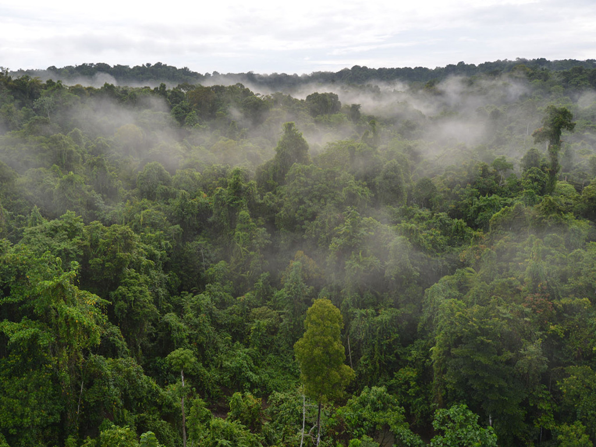
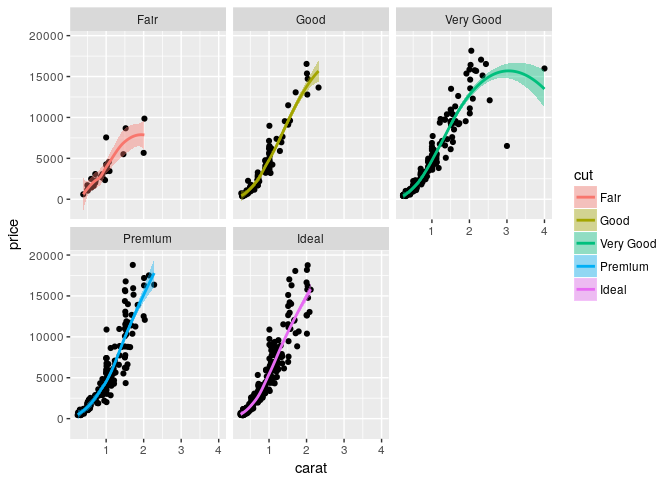
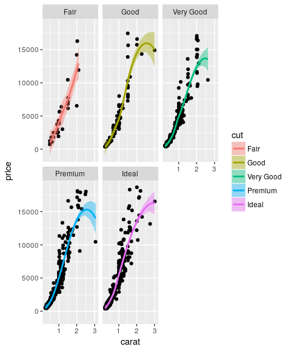
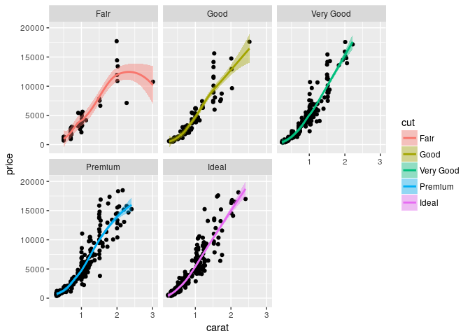

Here is a Markdown subheading (Level 2)
---------------------------------------

We can use markdown syntax to *italicize* or **bold** or
<s>strikethrough</s> text. Since Markdown doesn't include small-caps
functionality, we can still use functionality to .

We can use markdown syntax to include images:

However, there are some limits to markdown- for example, we can't resize
the figure to make it larger. We can always turn to code to specify
options for the image:

\begin{figure}[t]
\label{fig:pop}
\includegraphics[width=15cm, height=15cm,keepaspectratio]{images/tropical-forest.jpg}
\centering
\caption{Tropical forest!}
\end{figure}

Here is another Markdown subheading
-----------------------------------

### Let's add some equations

Here is code to write the likelihood equation that [PyRate uses to
estimate rates of speciation and
extinction](https://academic.oup.com/sysbio/article/63/3/349/1650079/Bayesian-Estimation-of-Speciation-and-Extinction)
(incedently, look! a footnote!). We can write the equation as an in-line
equation...

$P(X|s, e, q) = \\prod\_{i=1}^{n}P\_{NHPP}(t\_1^i, \\dots t\_{k\_{i}}^i|s\_i,e\_i,q)$

or as a numbered equation in the `equation` environment:

\begin{equation}
P(X|s, e, q) = \prod_{i=1}^{n}P_{NHPP}(t_1^i, \dots t_{k_{i}}^i|s_i,e_i,q)
\end{equation}

Citing documents
----------------

In this RMarkdown+world, citing documents becomes super easy. We have
included the following lines in the `YAML` header:

    bibliography: biblio.bib     
    csl: ecology-letters.csl

The first line here tells the software that knits our document that the
bibiolography for the document is stored in `biblio.bib`; the second
line tells the software that a style-guide that describes exactly how we
want our references formatted is saved at `ecology-letters.csl`.
**Note**: You can download the style sheet for your journal of choice
from [this repository of style sheets](https://www.zotero.org/styles).

Let's quickly inspect the contents of the files `biblio.bib`, which
contains the BibTeX formatted citations for the Cooney et al. paper that
we have used as a source for beak morphology data and for PyRate.
**NOTE** also that we are using the `system()` function in `R` to
execute shell commands from `R`- you may find this handy later on!

    system("cat biblio.bib", intern = T)

    ##  [1] "@article{Cooney_2017,"                                                                                                                                                                                 
    ##  [2] "\tdoi = {10.1038/nature21074},"                                                                                                                                                                        
    ##  [3] "\turl = {https://doi.org/10.1038%2Fnature21074},"                                                                                                                                                      
    ##  [4] "\tyear = 2017,"                                                                                                                                                                                        
    ##  [5] "\tmonth = {feb},"                                                                                                                                                                                      
    ##  [6] "\tpublisher = {Springer Nature},"                                                                                                                                                                      
    ##  [7] "\tvolume = {542},"                                                                                                                                                                                     
    ##  [8] "\tnumber = {7641},"                                                                                                                                                                                    
    ##  [9] "\tpages = {344--347},"                                                                                                                                                                                 
    ## [10] "\tauthor = {Christopher R. Cooney and Jen A. Bright and Elliot J. R. Capp and Angela M. Chira and Emma C. Hughes and Christopher J. A. Moody and Lara O. Nouri and Zoë K. Varley and Gavin H. Thomas},"
    ## [11] "\ttitle = {Mega-evolutionary dynamics of the adaptive radiation of birds},"                                                                                                                            
    ## [12] "\tjournal = {Nature}"                                                                                                                                                                                  
    ## [13] "}"                                                                                                                                                                                                     
    ## [14] "@article{Silvestro_2014,"                                                                                                                                                                              
    ## [15] "\tdoi = {10.1111/2041-210x.12263},"                                                                                                                                                                    
    ## [16] "\turl = {https://doi.org/10.1111%2F2041-210x.12263},"                                                                                                                                                  
    ## [17] "\tyear = 2014,"                                                                                                                                                                                        
    ## [18] "\tmonth = {sep},"                                                                                                                                                                                      
    ## [19] "\tpublisher = {Wiley-Blackwell},"                                                                                                                                                                      
    ## [20] "\tvolume = {5},"                                                                                                                                                                                       
    ## [21] "\tnumber = {10},"                                                                                                                                                                                      
    ## [22] "\tpages = {1126--1131},"                                                                                                                                                                               
    ## [23] "\tauthor = {Daniele Silvestro and Nicolas Salamin and Jan Schnitzler},"                                                                                                                                
    ## [24] "\teditor = {Liam Revell},"                                                                                                                                                                             
    ## [25] "\ttitle = {{PyRate}: a new program to estimate speciation and extinction rates from incomplete fossil data},"                                                                                          
    ## [26] "\tjournal = {Methods in Ecology and Evolution}"                                                                                                                                                        
    ## [27] "}"                                                                                                                                                                                                     
    ## [28] ""

Given that we have those two entries in the `biblio.bib` file, we can
cite them in the document using the syntax
`Here's a sentence that cites both papers [@Cooney_2017; @Silvestro_2014]`.
Here's a sentence that cites both papers (Silvestro *et al.* 2014;
Cooney *et al.* 2017).

A chunk of R code
-----------------

Just like any Rmd document, we can add R code chunks to this document:

    # make a plot using ggplot2
    library(ggplot2)

    # I sample from the diamonds dataset
    data(diamonds)
    d <- diamonds[sample(nrow(diamonds), 1000), ]

    # build the plot, of Price of Diamond v. Carat
    # Facet by the quality of the cut
    p <- ggplot(data = d, aes(x = carat, y = price)) +
      geom_point(aes(text = paste("Clarity:", clarity))) +
      geom_smooth(aes(colour = cut, fill = cut)) + facet_wrap(~ cut)

    ## Warning: Ignoring unknown aesthetics: text

    p

    ## `geom_smooth()` using method = 'loess'

### Controlling plot size

We can control the size of the plot by adding the `fig.height` and
`fig.width` arguments to the definition of the R chunk:

    # make a plot using ggplot2
    library(ggplot2)

    # I sample from the diamonds dataset
    data(diamonds)
    d <- diamonds[sample(nrow(diamonds), 1000), ]

    # build the plot, of Price of Diamond v. Carat
    # Facet by the quality of the cut
    p <- ggplot(data = d, aes(x = carat, y = price)) +
      geom_point(aes(text = paste("Clarity:", clarity))) +
      geom_smooth(aes(colour = cut, fill = cut)) + facet_wrap(~ cut)

    ## Warning: Ignoring unknown aesthetics: text

    p

    ## `geom_smooth()` using method = 'loess'

### Controlling code display, show code but don't run it

We might want to show code that we don't actually run in the document.
We can use the `eval = F` argument in the definiton of the R code chunk

    # make a plot using ggplot2
    library(ggplot2)

    # I sample from the diamonds dataset
    data(diamonds)
    d <- diamonds[sample(nrow(diamonds), 1000), ]

    # build the plot, of Price of Diamond v. Carat
    # Facet by the quality of the cut
    p <- ggplot(data = d, aes(x = carat, y = price)) +
      geom_point(aes(text = paste("Clarity:", clarity))) +
      geom_smooth(aes(colour = cut, fill = cut)) + facet_wrap(~ cut)

    p

#### or the other way, run code but don't show it

Alternatively, we might want to run some code and show the output, but
not actually show the code. We can do this with the argument `echo = F`

    ## Warning: Ignoring unknown aesthetics: text

    ## `geom_smooth()` using method = 'loess'

Other sources of help
---------------------

There's a lot of great places to get help on RMarkdown documents online:

-   RStudio's guide to Rmarkdown: [link]()  
-   WriteLatex's guide to Latex : [link]()  
-   Yihui Xie's book on Knitr: [link]()

Finally, importing in the references
------------------------------------

In the current setup, RStudio's Rmd to PDF conversion adds a
bibiolography to the end of the paper on a new page. Recall that the
citations are being formatted according to `ecology-letters.csl`. So, we
add a subheading for the references section at the end of our document:

References
----------

1.Cooney, C.R., Bright, J.A., Capp, E.J.R., Chira, A.M., Hughes, E.C. &
Moody, C.J.A. *et al.* (2017). Mega-evolutionary dynamics of the
adaptive radiation of birds. *Nature*, 542, 344–347.

2.Silvestro, D., Salamin, N. & Schnitzler, J. (2014). PyRate: A new
program to estimate speciation and extinction rates from incomplete
fossil data. *Methods in Ecology and Evolution*, 5, 1126–1131.
